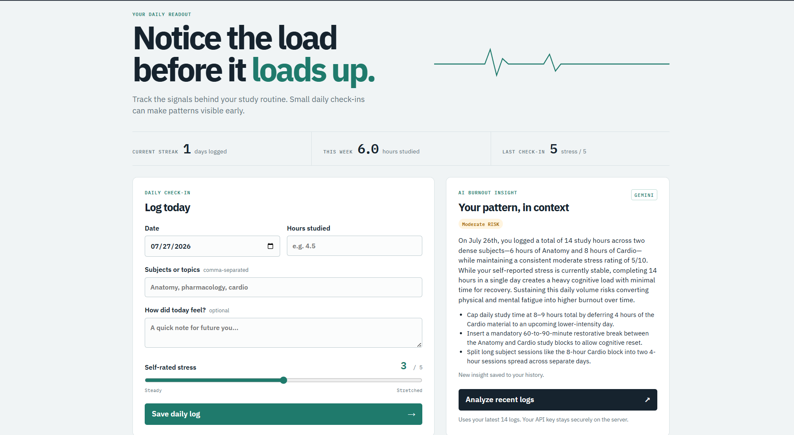
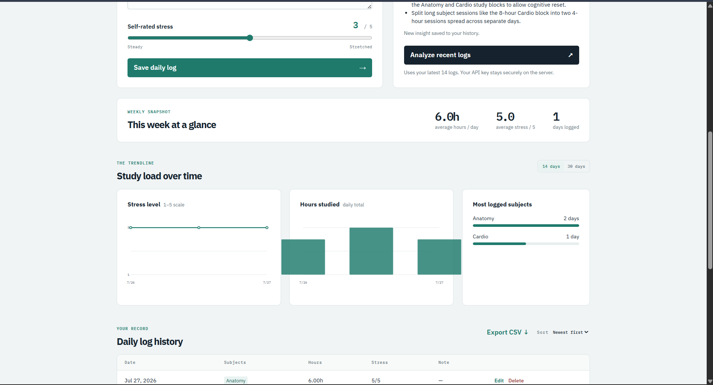
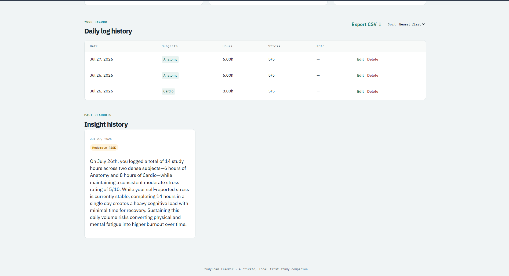

# StudyLoad Tracker

**Live URL:** _Add your deployed Vercel URL here_

StudyLoad Tracker is a private, local-first burnout early-warning tool for medical students. It turns daily study check-ins into a clear view of academic load, stress, and potential overload patterns before they become harder to manage.

## Features

- Daily entries for date, subjects/topics, study hours, stress (1–5), and an optional reflection note.
- Editable, sortable study history with delete controls.
- Consecutive-day logging streak and automatically calculated weekly totals and averages.
- Lightweight custom SVG charts for stress and study hours, with a 14/30-day selector.
- Subject-frequency breakdown to reveal areas receiving disproportionate focus.
- Gemini-powered burnout-pattern insight with a clear Low, Moderate, or High risk badge, factual reasoning, and three schedule-level suggestions.
- Saved AI insight history, so changing patterns can be reviewed over time.
- Local browser storage: no account, database, or personal data upload for normal tracking.
- CSV export of all study logs.
- Responsive clinical-vitals visual design with keyboard focus support and reduced-motion support.

## AI burnout insight

The browser sends the latest 14 logs to `/api/insight`. That Vercel serverless function reads `GEMINI_API_KEY` from the deployment environment and calls Gemini; the key is never included in client-side files. The result is saved only in the browser's local storage alongside the logs.

The server uses this exact system instruction:

```text
You are a supportive academic wellbeing analyst for medical students. Analyze the JSON array of daily study logs you receive for patterns linking information overload, sustained/rising stress, and early burnout risk — specifically: stress rising alongside rising hours or subject count (overload pattern), consistently high stress regardless of hours (chronic strain), long hours with little subject variation (monotony/no recovery), or sudden spikes vs. the rest of the week. Respond ONLY with valid JSON: { risk_level: 'Low'|'Moderate'|'High', reasoning: string (2-3 sentences referencing actual numbers/trends from the data), suggestions: array of 3 specific, actionable schedule adjustments (not generic advice) }. Tone: calm, factual, encouraging, never alarmist. Base risk_level strictly on the given data.
```

## Tech

- Plain HTML, CSS, and JavaScript — no build process or frontend framework.
- Custom inline SVG charts — no chart library.
- `localStorage` for on-device persistence.
- Node.js Vercel serverless function using Gemini `gemini-2.5-flash`.

## Screenshots

   
   *Logging a daily study session and viewing history*

   
   *AI-generated burnout risk analysis with suggestions*

   
   *Weekly hours and stress trend charts*

## Run locally

1. Clone the project and open the folder.
2. Copy `.env.example` to `.env` and set your Gemini key:

   ```bash
   GEMINI_API_KEY=your_key_here
   ```

3. Install the Vercel CLI if needed, then run:

   ```bash
   npx vercel dev
   ```

4. Open the local URL Vercel prints. Opening `index.html` directly is fine for the tracking dashboard, but the AI button requires the serverless route and therefore `vercel dev` or a deployed Vercel environment.

## Get a Gemini API key

1. Visit [Google AI Studio](https://aistudio.google.com/app/apikey) and create an API key.
2. Keep it private; do not put it in `app.js`, `index.html`, or commit it to Git.
3. For deployment, in Vercel open **Project → Settings → Environment Variables**, add `GEMINI_API_KEY`, paste the key, and redeploy.

## Deploy to Vercel

1. Push this repository to GitHub.
2. Import the repository in Vercel. No build command is needed.
3. Add the `GEMINI_API_KEY` environment variable as described above.
4. Deploy. Vercel serves the root static files and automatically deploys `api/insight.js` as the protected API route.

## Privacy note

The app is designed for personal reflection, not medical diagnosis or crisis support. Logs and saved insights are held in the current browser's local storage. Only a deliberate AI analysis sends the recent log data to Gemini via the server-side route.
